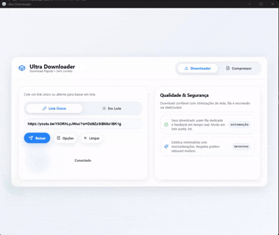
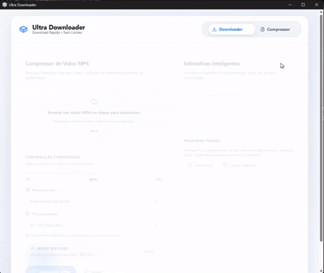

# UltraDownloader 🚀

## 1. Visão Geral

### O que é o UltraDownloader?
O **UltraDownloader** é uma ferramenta poderosa e simples para baixar vídeos e mídias da internet de forma rápida e descomplicada.

### Para que ele serve?
Ele serve para que você possa salvar seus vídeos favoritos, músicas e conteúdos de diversas plataformas diretamente no seu computador, para assistir ou ouvir quando quiser, mesmo sem internet.

### Para quem ele é indicado?
Este projeto é ideal para qualquer pessoa que queira baixar conteúdo da web sem precisar lidar com configurações complexas ou sites cheios de anúncios. Seja você um usuário comum ou alguém que gosta de tecnologia, o UltraDownloader foi feito para você.
### Exemplo de uso:



---

## 2. Como Usar (Usuário Comum – Release)

Se você quer apenas usar o programa, siga estes passos simples:

1.  **Baixe a versão mais recente**: Vá até a aba "Releases" aqui no GitHub e faça o download do último arquivo disponibilizado.
2.  **Extraia o arquivo**: O download virá compactado. Clique com o botão direito e escolha "Extrair aqui" ou "Extrair para..." em uma pasta de sua preferência.
3.  **Abra o programa**: Localize o arquivo executável `UltraDownloader.exe` e clique duas vezes para abrir.
4.  **Aviso de Segurança**: Ao abrir, o Windows pode exibir uma tela azul dizendo que "o Windows protegeu o computador" ou que o arquivo é perigoso.
    *   **Não se preocupe!** Isso acontece porque o aplicativo é novo e ainda não possui um certificado digital da Microsoft.
    *   Para continuar, clique em **"Mais informações"** e depois em **"Executar assim mesmo"**. O programa é totalmente seguro e vai abrir normalmente.

---

## 3. Como Usar (Usuário Avançado – Código-Fonte)

Se você é desenvolvedor ou gosta de mexer no código, veja como rodar o projeto na sua máquina:

1.  **Clone o repositório**:
    Abra seu terminal e rode o comando:
    ```bash
    git clone https://github.com/lucasjordaoreal/UltraDownloader.git
    ```

2.  **Pré-requisitos**:
    Certifique-se de ter o **Python** instalado no seu computador.

3.  **Instale as dependências**:
    Entre na pasta do projeto e instale os pacotes necessários:
    ```bash
    pip install -r requirements.txt
    ```

4.  **Execute o projeto**:
    Agora é só rodar o comando principal:
    ```bash
    python main_entry.py
    ```

5.  **Comece a usar**:
    O programa será iniciado e você terá acesso total a todas as funcionalidades!

---

* UltraDownloader Feito para simplificar sua vida!
